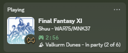

# phxpresence

Discord Rich Presence for **Final Fantasy XI**, as an [Ashita v4](https://github.com/AshitaXI/Ashita-v4beta) addon.

While it's loaded, your Discord profile shows what you're up to in Vana'diel — your
character name (optional), job/subjob, current zone, party status, and elapsed time.
It tracks your in-game `/seek`, `/away` and `/anon` flags automatically, and shows
your search comment (`/seacom`) when you hover the job icon.

It talks to your local Discord desktop app over its RPC pipe — no Discord login,
OAuth, or native DLLs. Discord just needs to be running on the same machine.

## Install

1. Copy the `phxpresence` folder into your Ashita `addons` directory.
2. Run `/addon load phxpresence` (or add it to your Ashita script).
3. Make sure the Discord desktop app is running.

Run `/phxpresence` in-game to open the config window; `/phxpresence help` lists the
chat commands. `/phxp` is a shortcut for `/phxpresence`.

## Credits

Job icons (`assets/jobs/`) — Final Fantasy XIV (Square Enix) and
[Tylas11](https://github.com/Tylas11), via the [XIUI](https://github.com/tirem/XIUI) addon.

## License

[MIT](LICENSE)
